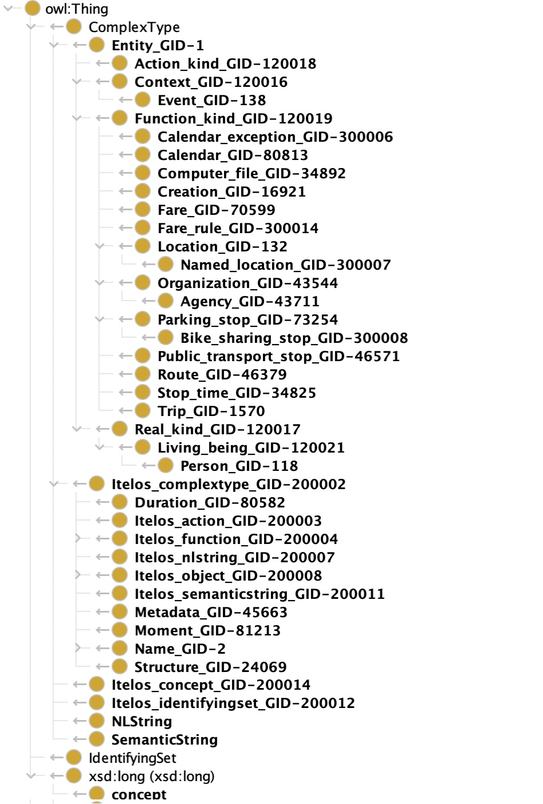

# Trentino Transportation

> Material: <https://drive.google.com/drive/folders/12p27IFsmy9Us4AD2lw_0fEvl1k7BaIMk?usp=sharing>
> 
> GitHub: <https://github.com/carlocorradini/Trentino_Transportation>

By Carlo Corradini and Xuanli Li

## Domain
This project aims to comprehensively consider the transportation situations under the specific Trentino region, not only involving the public transportation services but also the personal tracks. Collecting the latest temporal and spatial information and integrating the data and knowledge from diverse sources. Public transportation services, vehicles, bus stations, train stations, railways, highways, simple streets, public transportation service timelines, and trip schedules are the main important elements that will be mainly paid attention, besides, the mixed using of some vehicles and the parking path will be exploring.

## Purpose
With the development of big data technology and cloud storage technology, we are in an era of the rapid increase in information, with countless data or knowledge. How to manage these data and achieve more efficient sharing and utilization is an area that many researchers are exploring, that is, to fulfill the integration of knowledge and data in specific, rather than leaving information be unorganized. This report focuses on integrating all the public transportation as well as sharing vehicles information within Trentino so that a more complete transport information system could help people make a better decision and save time or money as much as possible. Specifically, we pay attention to the application of vehicles that GTFS has not covered, such as sharing bikes, sharing cars, and so on so forth, which is added to the system, and then residents have more choices when determining paths.

## Datasets
The 7 initial datasets we used in total and the brief descriptions are delineated below:

1. Trentino Trasporti 
   <https://www.trentinotrasporti.it/open-data> 
   Tentino Trasporti offers users the data of bus, train, and cable car in the format of GTFS. This dataset has a different text file and each file represents an aspect of data, like routes, stops, agency etc.
2. Trasporti pubblici del Trentino 
   <https://dati.trentino.it/dataset/trasporti-pubblici-del-trentino-formato-gtfs> 
   Trentino Trasporti extended dataset containing fares information. The Trentino Trasporti dataset available on the official site does not contain information about ticket prices and payment methods. Therefore, this dataset is an extension that contains both the information contained in the official dataset and information about prices. 
  Note that the official dataset is updated regularly weather this every six months only.
  In GTFS the information about fares are respectively [fare_attributes.txt](https://developers.google.com/transit/gtfs/reference#fare_attributes.txt) and [fare_rules.txt](https://developers.google.com/transit/gtfs/reference#fare_rulestxt).
3. Parcheggio protetto per biciclette 
   <https://dati.trentino.it/dataset/parcheggio-protetto-per-biciclette-open-data> 
   This dataset is provided by the Municipality of Trento, which is the data about three protected car parks for bicycles. The attributes comprise the names, location, slots, and so on.
4. Stazioni Bikesharing 
   <https://dati.trentino.it/dataset/stazioni-bike-sharing-emotion-trentino> 
   This dataset shows the situation of the bike sharing stations near different city's municipalities. The main attributes including the station location, the available bike, and empty slots etc.
5. C’entro in bici 
   <https://dati.trentino.it/dataset/c-entro-in-bici-open-data> 
   The dataset offers the data about bicycle rental service for public use for travel within the city center. It still displays different properties, that is, the location, number of total bikes, contact, and so on.
6. Car sharing 
   <https://dati.trentino.it/dataset/car-sharing-open-data> 
   This dataset demonstrates the data of the Car sharing vehicles within Trentino. It shows the location of sharing car station, the id, the car availability of the stations, etc.
7. Taxi 
   <https://dati.trentino.it/dataset/taxi-open-data> 
   The dataset manifests the data about the taxi within the municipal area. It reveals the some attributes such as location, price, telephone, and so on so forth.
   
## Reference Schemas
1. GTFS 
   <https://developers.google.com/transit/gtfs/reference> 
   Our main reference schema is GTFS static transit, which defines a common format for public transportation schedules and associated geographic information. GTFS "feeds" let public transit agencies publish their transit data and developers write applications that consume that data in an interoperable way, for example, Trentino Transporti applies GTFS format to represent their data.
2. ParkingFacility 
   <https://schema.org/ParkingFacility> 
   Schema.org provides us a number of reference sechmas. ParkingFacility defines some etypes and peoperties about parking lot or other parking facility. Since we have bike, car and taxi parking stop datasets, ParkingFacility offers the related concepts for creating our ontology.

## ETG

> <https://drive.google.com/drive/folders/1-8ZkqbEZx3lub4H8jUNB-c5bIZ8ptkNe?usp=sharing>

### Classes

### Object Properties

### Data Properties

## KG

> <https://drive.google.com/drive/folders/1d7QPcG3uI9aHw_UXUsKuiDtCzOwapA-f?usp=sharing>

### Karmalinker

#### Model
> <https://drive.google.com/drive/folders/1CKqRS7BNZgsI-JfODf2f7QQR9_r4TXDg?usp=sharing>

#### RDF

> <https://drive.google.com/drive/folders/1jCidpiOWW3D0rZ6omCVYLl81rzbPIGut?usp=sharing>

## License

MIT
